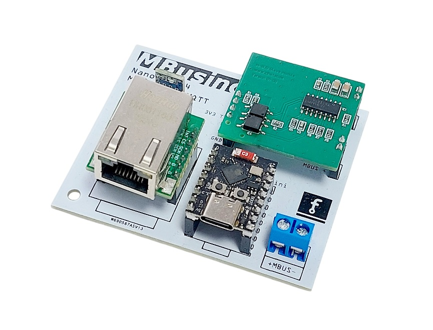
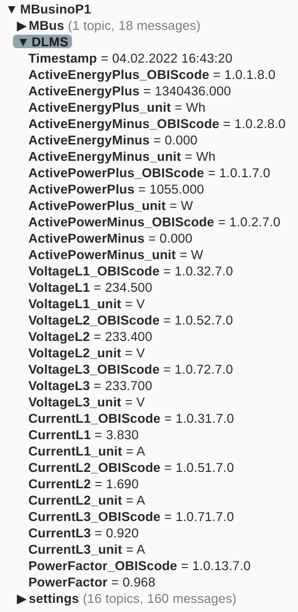

# MBusinoP1
 
### M-Bus P1 DLMS / COSEM --> MQTT-Gateway for austrian energy meters

A **Plug and Play** solution.

The **MBusinoP1** is an Arduino MQTT Gateway for austrian el. energy meters with the M-Bus P1 DLMS/COSEM interface.

DLMS/COSEM decoding uses the library [**DlmsCosemLib**](https://github.com/Zeppelin500/DlmsCosemLib). Test the library [**via Wokwi.**](https://wokwi.com/projects/445347018581022721).

MBusino has a captive and setup portal to configure WiFi, MQTT and the decryption key.

The project is based on [**MBusino**](https://github.com/Zeppelin500/mbusino) and use the Hardware of MBusino Nano. Only the M-Bus master has been replaced with a slave.

## Code

the project is developed with **Arduino IDE 2**, source code and .bin files will be find at the **src** folder.  

## Hardware

The code is running at a ESP32 C3 Supermini and M-Bus is provided by a piggyback M-Bus slave. https://www.hwhardsoft.de/2025/10/28/mbus-slave-modul/

You will find a 3D-printable PCB case inside the case folder.

## Access Point to configure,  MBusino Setup Portal

* SSID **MBusino Setup Portal** IP(normally not needed): 192.168.4.1
* If Mbusino do not find a known network, he start an AP for 5 minutes. After this period, he will restart and search again.
* In known networks, you will find the IP of the portal under **MBusino** in your router.

## MQTT Output

## Home-Assistant

### TBD! Autodiscovery is not ready until now.

If you use Home Assistant, MBusino supports autodiscover. You need only the MQTT integration and MBusino will be find as device with all records.
Every 256th record message is a autodiscover message. 
If you use not Home Assistant, no matter. All records will be send as MQTT message.

## Tutorial

https://github.com/Zeppelin500/MBusinoP1/tree/main/tutorial

## known issues / limitations

- Do not use 2 Boards simultaneously without changing there Names or it cause in network problems, both boards becomes unreachable. 

- passwords are limited to 29 characters

## Credits

Thanks to **DomiStyle** for https://github.com/DomiStyle/esphome-dlms-meter where some ideas for decoding come from.

Thanks to **HWHardsoft** for the code base of the DlmsCosemLib Library https://github.com/HWHardsoft/DLMS-MBUS-Reader and for providing the piggyback M-Bus slave.

## Current topics

https://github.com/Zeppelin500/MBusinoP1/discussions

## Licence
****************************************************
This program is free software: you can redistribute it and/or modify it under the terms of the GNU General Public License as published by
the Free Software Foundation, either version 3 of the License, or (at your option) any later version. This program is distributed in the hope that it will be useful,
but WITHOUT ANY WARRANTY; without even the implied warranty of MERCHANTABILITY or FITNESS FOR A PARTICULAR PURPOSE.  See the GNU General Public License for more details.
You should have received a copy of the GNU General Public License along with this program.  If not, see <http://www.gnu.org/licenses/>.
****************************************************

